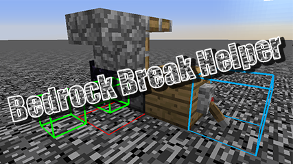

# Bedrock Break Helper

[中文](./README_zh-CN.md)

* Helps you breaking bedrocks using newcake's [method](https://youtu.be/Tu4C3QNBdRY).
* **REQUIRES** [malilib](https://www.curseforge.com/minecraft/mc-mods/malilib) and its dependency [Fabric API](https://www.curseforge.com/minecraft/mc-mods/fabric-api).
    
    
* Shows valid positions to place redstone signal sources.
    - Greed/Lime/Orange box: possible positions and it's empty;
        - Green: TNT can be placed high or low above the ground;
        - Lime: TNT can only be placed near the ground(explosion should be mostly blocked);
        - Orange: TNT can only be placed high(about 3 blocks) above the ground(explosion should only be slightly blocked);
    - Red box: possible positions but occupied by a non-redstone-singal-source block;
    - Blue box: possible positions and there's a redstone signal source block.

**ATTENTION: The mechanics of breaking a bedrock is complicated.**
**Relative position of tnt, other damageable block and chunk border may affect the result.**

**The code is okay mostly. But if you fail multiple times, consider change the position of tnt, signal source or use a different method to break the bedrock.**

# How to use
* Use **grave(\`) key**(default) to toggle on/off;
    - **Ctrl + \`** to change rendering distance;
    - **Alt + \`** to toggle if positions two-blocks far from pistons will also be rendered.

# Thanks
Use the code from Fallen-Breath's [calculator](https://github.com/Fallen-Breath/IronHeadHelper) to calculate possible positions.

[Malilib](https://github.com/maruohon/malilib/tree/rift_1.13.2/), I had a hard time setting up Mixins, and using Malilib is much easier.